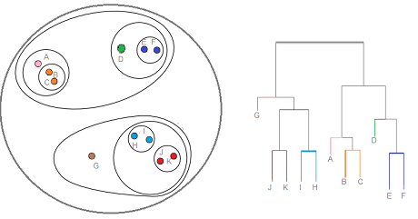
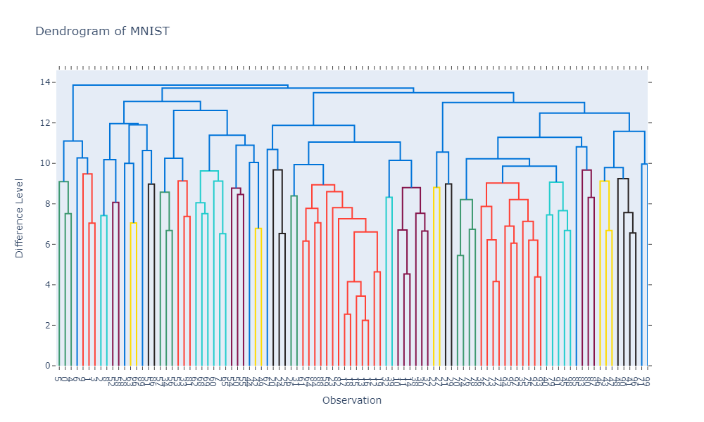

# Clustering

---

# Unsupervised Learning

- Used for recommended movies on Netflix, or suggested purchases on Amazon, where we don’t have a clear fix on what exactly we (as analysts) are looking for
- **Any case where we seek to group observations by deciding which are most closely related to one another based on the data inputs**
    - There is not necessarily a "true" value or "right" answer in unsupervised learning


---

# Unsupervised Learning

- Better understand our data
- Find groups in observations 

---

# k-Means Clustering

- Specify the number of clusters
- Find optimal clusters by locating "centroid" points at positions of least distance from cluster members

---


---

# Heirarchical Clustering

- **Heirarchy** - organizing a group from highest to lowest in some measureable trait
- In our case, it will be similarity to other observations

---

# Heirarchical Clustering - Steps

1) Determine the distance between each observation/cluster in the data and the other observations/cluster
2) Find the two observations/cluster that are closest, and join them together into a cluster
3) If there is more than one observation/cluster remaining, return to step 1.

---



---

# Heirarchical Clustering - Subjectivity

Unsupervised learning models like clustering are inherently subjective
- You have to choose how many clusters!
- This takes time, careful reasoning, and practice

---

# Clustering in `sklearn`

```python
import pandas as pd

# Read in data
data = pd.read_csv(
    "https://github.com/dustywhite7/pythonMikkeli/blob/master/exampleData/mnistTrain.csv?raw=true")

# Grab 10 observations of each digit (0 to 9)
data = data.groupby('Label').apply(lambda x: x.sample(n=10)).reset_index(drop=True)
```

---

# Clustering in `sklearn`

```python
from sklearn.cluster import AgglomerativeClustering

y = data['Label']
x = data.drop('Label', axis=1)

clusters = AgglomerativeClustering(
    distance_threshold=0, 
    n_clusters=None).fit(x)
```

---

# Assigning observations to clusters

```python
# I specify 10 groups, because MNIST has 10 unique labels

AgglomerativeClustering(
    distance_threshold=None, 
    n_clusters=10).fit_predict(x)
```

---

# Plotting the clusters

```python
# Import statements
import plotly.figure_factory as ff
import plotly.offline as py

py.init_notebook_mode(connected=True)

# Create the dendrogram
fig = ff.create_dendrogram(x, orientation = 'bottom')

# Make the figure look nice
fig.update_xaxes(title="Difference Level", tickangle=90)
fig.update_yaxes(title="Observation")
fig.layout.title = "Dendrogram of MNIST"
fig.layout.width=1000
fig.layout.height=600

# Plot the figure
py.iplot(fig)
```

---



---

# Observations

- Clustering is a great way to learn more about the data
- NOT a good predictive model

You should instead clustering as a supplement, or pre-processing, to a supervised learning model

---

# Lab Time!